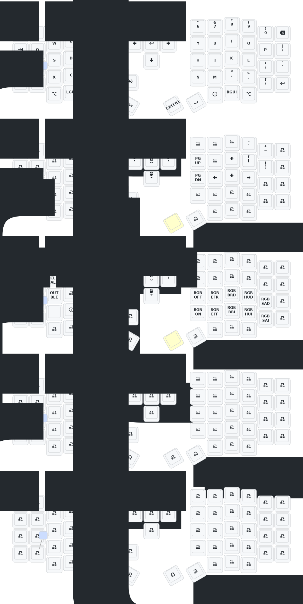

- [中文](README.md)
- [English](README_EN.md)

# 更新列表
- 2025/3/30 增加睡眠进入时间1小时  增加防抖时间 优化睡眠后功耗 
- 2024/12/21
  1. 增加zmk-studio支持（只需要刷新左手即可使用）。
- 2024/10/24
  1. 修改供电模式，功耗降低。
  2. 修正RGB供电自动关闭的功能。

> 如果您的键盘于10月24日之前更新，请更新最新的固件。
> 
---
# 联系我

如需3D打印的模型文件或者键盘有任何异常和故障，请联系380465425@qq.com

# Sofle键位图

https://nickcoutsos.github.io/keymap-editor/
修改键位图请使用上面的链接，可以直接加载 github 项目

修改完了以后要注意人工 fix 一下保存的 solfe.keymap，把里面的 `#include <dt-bindings/zmk/pointing.h>` 去掉，这个会导致编译错误

提交以后触发 github action，结束后下载 left 和 right 两个文件，连接键盘到电脑，按两下侧边的按钮会出现 USB 设备，分别把 left 和 right 文件拖进去，设备会自动弹出，搞定
