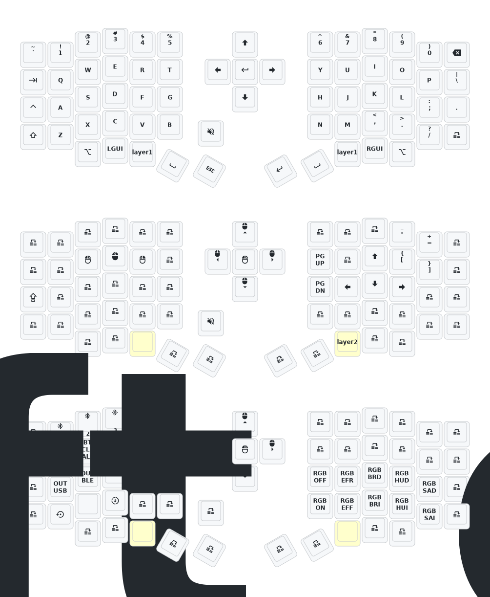

2024年10月24日更新内容：修改供电模式，功耗降低。修正RGB供电自动关闭的功能。如果您的键盘于10月24日之前更新，请更新最新的固件。
Update on October 24, 2024: Modified power supply mode to reduce power consumption. Corrected the function of automatic shutdown of RGB power supply. If your keyboard is updated before October 24th, please update the latest firmware.

如需3D打印的模型文件或者键盘有任何异常和故障，请联系380465425@qq.com
If you need the 3D printed model file or if there are any abnormalities with the keyboard, please contact 380465425@qq.com

# zmk-config-sofle

https://nickcoutsos.github.io/keymap-editor/
修改键位图请使用上面的链接，可以直接加载 github 项目

修改完了以后要注意人工 fix 一下保存的 solfe.keymap，把里面的 `#include <dt-bindings/zmk/pointing.h>` 去掉，这个会导致编译错误

提交以后触发 github action，结束后下载 left 和 right 两个文件，连接键盘到电脑，按两下侧边的按钮会出现 USB 设备，分别把 left 和 right 文件拖进去，设备会自动弹出，搞定
